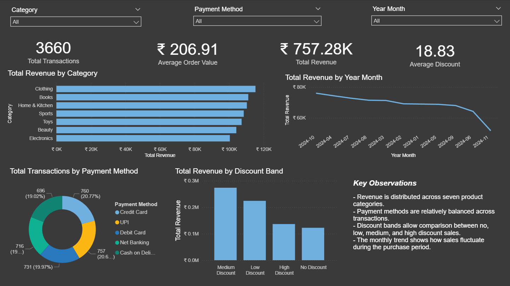

# E-Commerce Sales Dashboard

## Project Overview

This project is a Power BI dashboard built using a fictional e-commerce dataset from Kaggle.

The dashboard analyses sales performance, product categories, discounts, payment methods, and purchasing trends. The purpose of this project is to practise Power BI dashboard development while showcasing skills in data preparation, DAX measures, KPI design, visual analysis, and business insight communication.

## Dataset

Dataset: [E-Commerce Dataset on Kaggle](https://www.kaggle.com/datasets/steve1215rogg/e-commerce-dataset/data)

The dataset contains fictional e-commerce transaction records with fields such as:

- User ID
- Product ID
- Product Category
- Price
- Discount
- Final Price
- Payment Method
- Purchase Date

The raw dataset is not stored in this repository. It can be downloaded from the Kaggle link above.

## Dashboard Preview

## Business Questions

This dashboard explores the following questions:

1. What is the overall sales performance?
2. Which product categories generate the most revenue?
3. How are discounts distributed across transactions?
4. Which payment methods are most commonly used?
5. How does revenue change over time?

## Key Metrics

The dashboard includes the following metrics:

- Total Revenue
- Total Transactions
- Average Order Value
- Average Discount
- Number of Categories
- Revenue by Category
- Transactions by Payment Method
- Revenue Trend Over Time
- Revenue by Discount Band

## Tools Used

- Power BI
- Power Query
- DAX
- Kaggle dataset

## Data Preparation

Basic data preparation was completed in Power Query:

- Renamed columns for readability
- Converted price and final price fields to decimal number type
- Converted discount field to whole number type
- Converted purchase date to date type using day-month-year format
- Checked for missing values
- Checked for duplicate records
- Created a discount band column for easier analysis

## Dashboard Sections

### 1. KPI Summary

The top section of the dashboard provides a quick overview of business performance using KPI cards.

Included metrics:

- Total Revenue
- Total Transactions
- Average Order Value
- Average Discount

This section gives users an immediate understanding of the overall scale and performance of the dataset.

### 2. Revenue by Category

This section compares total revenue across product categories.

It helps identify which categories contribute the most to overall sales and which categories perform weaker compared with others.

### 3. Revenue Trend Over Time

This section shows how revenue changes across the purchase period.

It helps identify sales patterns, fluctuations, and possible seasonal changes.

### 4. Payment Method Analysis

This section shows the distribution of transactions by payment method.

It helps understand customer payment preferences across the dataset.

### 5. Discount Analysis

This section groups transactions into discount bands.

It helps analyse how much sales activity occurs under different discount levels.

## Skills Demonstrated

This project demonstrates:

- Importing CSV data into Power BI
- Cleaning and preparing data in Power Query
- Creating DAX measures
- Creating a date table
- Building KPI cards
- Designing bar charts, line charts, and donut charts
- Adding slicers for interactivity
- Creating a clean dashboard layout
- Communicating business insights from dashboard visuals

## Notes

This is a practice and portfolio project using a fictional dataset. The dashboard is intended to demonstrate Power BI and business intelligence skills rather than represent a real company.