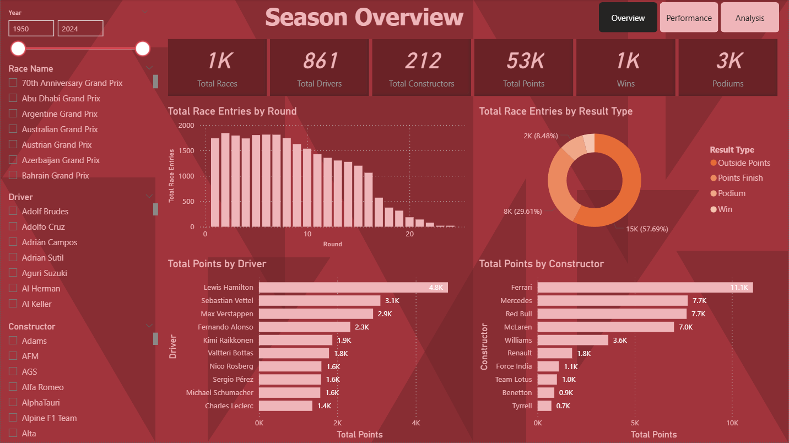
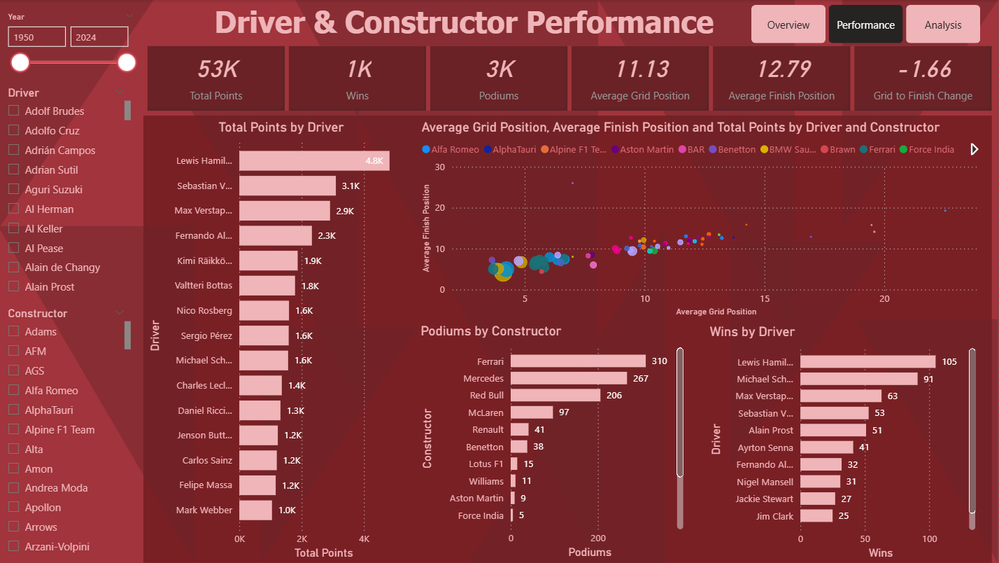
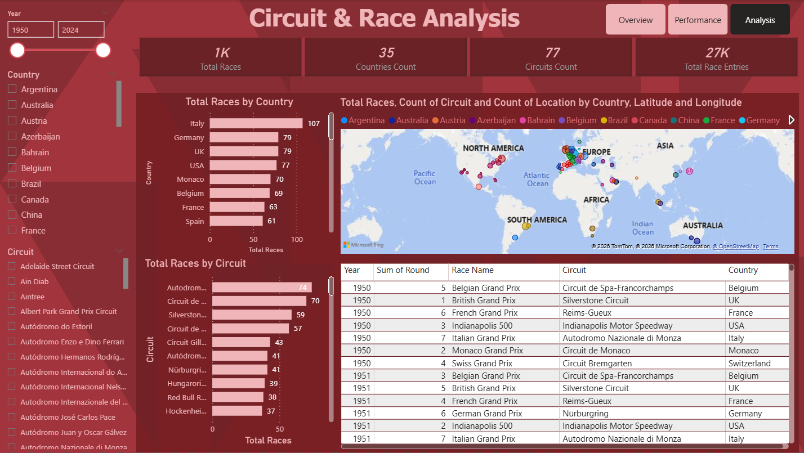

# Formula 1 Race Performance Dashboard

## Project Overview

This project is a Power BI dashboard built using a Formula 1 World Championship dataset from Kaggle.

The dashboard analyses Formula 1 race performance across seasons, drivers, constructors, circuits, wins, podiums, points, and race outcomes. The purpose of this project is to practise Power BI dashboard development while showcasing skills in data modelling, relationship building, DAX measures, sports analytics, ranking analysis, and interactive dashboard design.

## Dataset

Dataset: [Formula 1 World Championship (1950–2024) on Kaggle](https://www.kaggle.com/datasets/rohanrao/formula-1-world-championship-1950-2020)

The dataset contains Formula 1 race data from 1950 to 2024, including files related to races, drivers, constructors, circuits, qualifying, lap times, pit stops, race results, and championship standings.

For this dashboard, the main files used are:

- races.csv
- results.csv
- drivers.csv
- constructors.csv
- circuits.csv

The raw dataset is not stored in this repository. It can be downloaded from the Kaggle link above.

## Dashboard Preview

## Analytical Questions

This dashboard explores the following questions:

1. Which drivers achieved the most points, wins, and podium finishes?
2. Which constructors performed strongest across seasons?
3. How does Formula 1 performance change by season?
4. Which circuits hosted the most races?
5. How do drivers and constructors compare within a selected year?
6. What race-result patterns can be identified from historical F1 data?

## Notes

This is a practice and portfolio project using a public sports dataset. The dashboard is intended to demonstrate Power BI and sports analytics skills rather than provide official Formula 1 statistics.