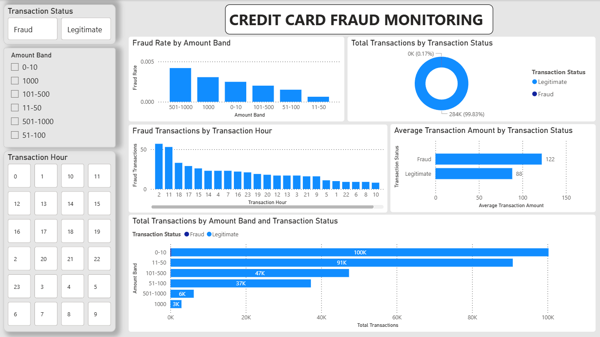

# Credit Card Fraud Monitoring Dashboard

## Project Overview

This project is a Power BI dashboard built using the Credit Card Fraud Detection dataset from Kaggle.

The dashboard analyses credit card transaction behaviour, fraud rate, transaction amount risk, class imbalance, and fraud distribution over time. The purpose of this project is to practise Power BI dashboard development while showcasing skills in financial risk analytics, data preparation, DAX measures, KPI design, visual analysis, and business insight communication.

## Dataset

Dataset: [Credit Card Fraud Detection on Kaggle](https://www.kaggle.com/datasets/mlg-ulb/creditcardfraud)

The dataset contains anonymised credit card transactions with fields such as:

- Time
- Amount
- Class
- V1 to V28 anonymised PCA features

The `Class` field identifies whether a transaction is fraudulent or legitimate:

- `0` = Legitimate transaction
- `1` = Fraudulent transaction

The raw dataset is not stored in this repository. It can be downloaded from the Kaggle link above.

## Dashboard Preview

## Business Questions

This dashboard explores the following questions:

1. What is the overall fraud rate?
2. How many transactions are fraudulent compared with legitimate transactions?
3. What transaction value is associated with fraud?
4. How does transaction amount differ between legitimate and fraudulent transactions?
5. How does fraud activity change across time?
6. How severe is the fraud class imbalance?

## Tools Used

- Power BI
- Power Query
- DAX
- Kaggle dataset

## Dashboard Sections

### 1. KPI Summary

The top section of the dashboard provides a quick overview of transaction and fraud activity using KPI cards.

Included metrics:

- Total Transactions
- Fraud Transactions
- Fraud Rate
- Total Transaction Amount
- Fraud Transaction Amount
- Average Transaction Amount

This section gives users an immediate understanding of the fraud scale and financial exposure.

### 2. Fraud vs Legitimate Transactions

This section compares the number of legitimate and fraudulent transactions.

It highlights the strong class imbalance in the dataset and shows how rare fraud cases are compared with normal transactions.

### 3. Transaction Amount Analysis

This section compares transaction amount patterns between legitimate and fraudulent transactions.

It helps identify whether fraudulent transactions are concentrated in certain amount ranges.

### 4. Fraud Over Time

This section shows fraud activity across transaction hours.

It helps identify whether fraudulent transactions appear more often during certain time periods.

### 5. Amount Band Risk Analysis

This section groups transactions into amount bands.

It helps compare fraud rate and transaction volume across different transaction value levels.

## Notes

This is a practice and portfolio project using an anonymised public dataset. The dashboard is intended to demonstrate Power BI and financial risk analytics skills rather than provide a production fraud detection system.