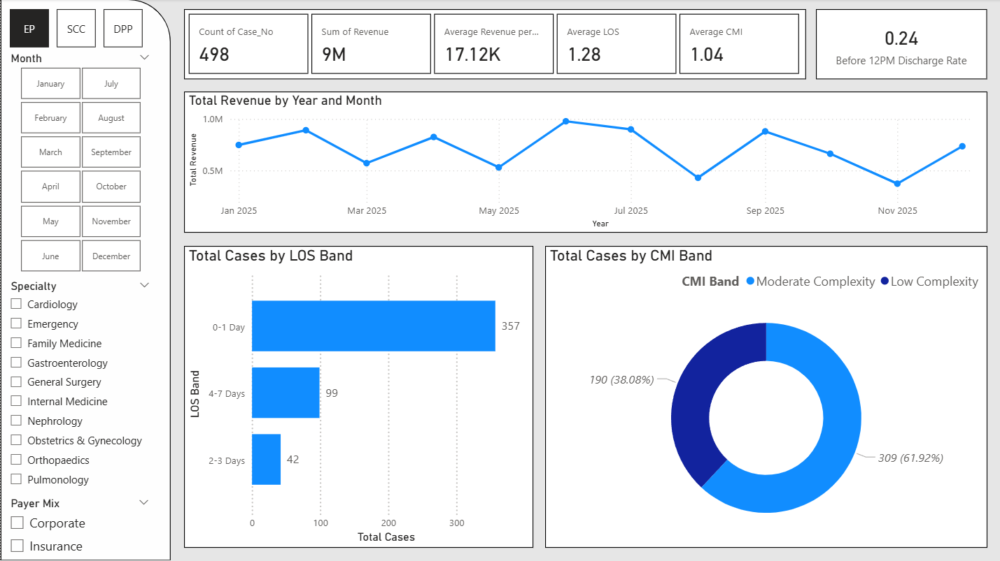
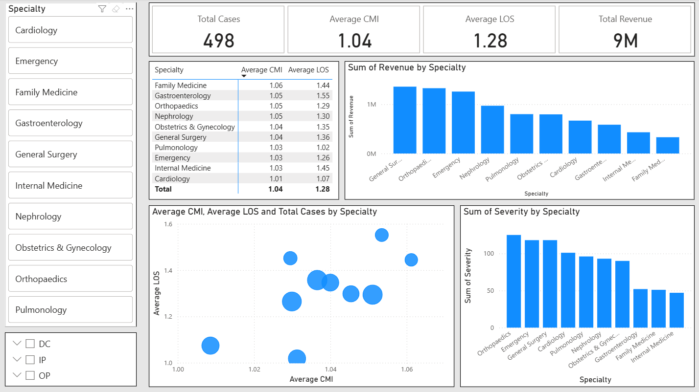
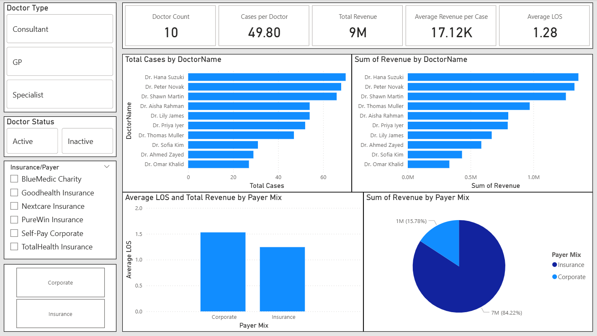

# Hospital Operations Command Center

## Project Overview

This project is a Power BI dashboard built using a synthetic Hospital Operations Dataset from Kaggle.

The dashboard analyses hospital operations across patient volume, department activity, admissions, occupancy, treatment flow, billing, and operational performance. The purpose of this project is to practise Power BI dashboard development while showcasing skills in healthcare analytics, KPI design, DAX measures, Power Query data preparation, and professional dashboard design.

The dashboard is designed as a hospital operations command center, giving hospital administrators a high-level view of demand, resource pressure, department workload, and financial performance.

## Dataset

Dataset: Hospital Operations Dataset on Kaggle

The dataset simulates hospital operations, clinical, and financial data for analytics and visualisation practice. It is designed for Power BI dashboards, DAX metrics, and healthcare KPI modelling.

The raw dataset is not stored in this repository. It can be downloaded from Kaggle.

## Dashboard Preview

## Analytical Questions

This dashboard explores the following questions:

1. What is the overall hospital activity level?
2. Which departments handle the highest patient volume?
3. How are admissions and discharges changing over time?
4. Which departments or services create the highest operational pressure?
5. What are the main billing and financial patterns?
6. How can hospital administrators identify areas needing attention?

## Dashboard Pages

### 1. Operations Overview

This page provides a command-center summary of hospital performance.

It includes key metrics such as total patients, total admissions, average length of stay, total billing amount, average billing amount, and department activity.

### 2. Department & Patient Flow

This page analyses patient movement across departments, admission types, treatment flow, and hospital workload.

It helps identify departments with higher demand and possible operational pressure.

### 3. Financial Performance

This page focuses on billing, insurance/payment patterns, department-level revenue, and cost-related indicators.

It helps connect operational activity with financial outcomes.

## Tools Used

- Power BI
- Power Query
- DAX
- Kaggle dataset

## Skills Demonstrated

- Healthcare operations analysis
- Power Query data preparation
- DAX measure creation
- KPI dashboard design
- Department-level performance analysis
- Patient flow analysis
- Financial analytics
- Interactive slicers and navigation
- Custom tooltip pages
- Professional dashboard layout and theme design

## Notes

This project uses a synthetic dataset for portfolio and learning purposes. The dashboard is intended to demonstrate healthcare analytics and Power BI design skills, not to provide real medical or operational advice.