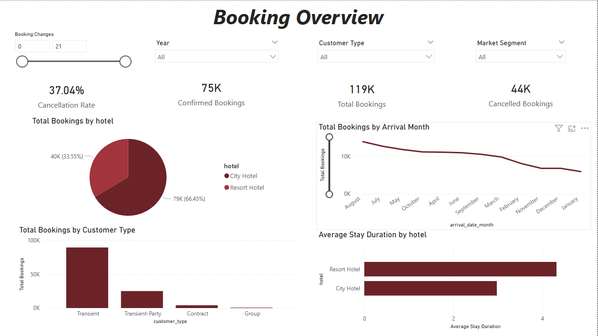
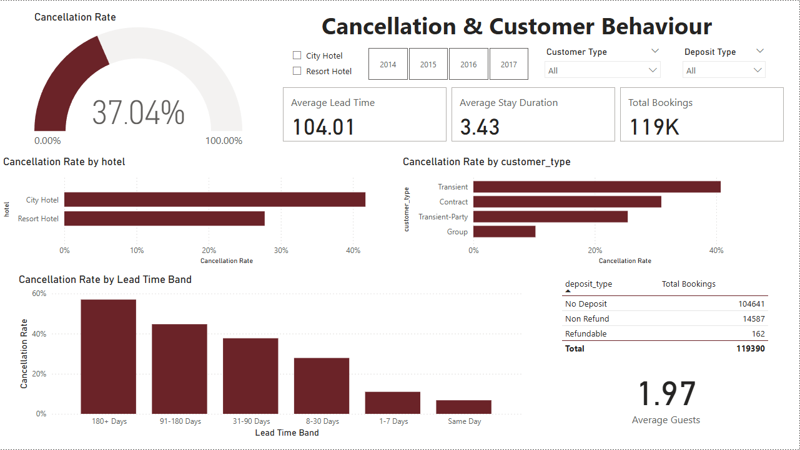

# Hotel Booking & Cancellation Dashboard

## Project Overview

This project is a Power BI dashboard built using the Hotel Booking Demand dataset from Kaggle.

The dashboard analyses hotel booking patterns, cancellation behaviour, customer segments, seasonal demand, lead time, and stay duration. The purpose of this project is to practise Power BI dashboard development while showcasing skills in data preparation, DAX measures, KPI design, business analysis, and insight communication.

Unlike a simple sales dashboard, this project focuses on operational and customer-behaviour analysis in the hospitality industry.

## Dataset

Dataset: [Hotel Booking Demand on Kaggle](https://www.kaggle.com/datasets/jessemostipak/hotel-booking-demand)

The dataset contains booking information for a city hotel and a resort hotel. It includes information such as booking lead time, length of stay, number of guests, booking status, hotel type, customer type, and arrival date information.

The raw dataset is not stored in this repository. It can be downloaded from the Kaggle link above.

## Dashboard Preview

## Business Questions

This dashboard explores the following questions:

1. What is the overall booking and cancellation performance?
2. Which hotel type receives more bookings?
3. What is the cancellation rate across hotel types?
4. How does booking demand change across months?
5. How does lead time relate to cancellations?
6. Which customer segments contribute most to bookings and cancellations?
7. How long do guests usually stay?

## Key Metrics

The dashboard includes the following metrics:

- Total Bookings
- Confirmed Bookings
- Cancelled Bookings
- Cancellation Rate
- Average Lead Time
- Average Stay Duration
- Total Guests
- Bookings by Hotel Type
- Bookings by Customer Type
- Monthly Booking Trend

## Dashboard Sections

### 1. Executive Summary

This section provides a high-level overview of hotel booking performance.

It includes KPI cards for total bookings, confirmed bookings, cancelled bookings, cancellation rate, average lead time, and average stay duration.

The purpose of this section is to quickly show the scale of booking activity and the seriousness of cancellation behaviour.

### 2. Hotel Type Comparison

This section compares City Hotel and Resort Hotel bookings.

It helps identify which hotel type has more bookings, higher cancellation rates, and different customer behaviour patterns.

### 3. Cancellation Analysis

This section focuses on cancellation behaviour.

It analyses cancellations by hotel type, customer type, lead time group, and deposit type where available.

The purpose is to understand which booking conditions are associated with higher cancellation risk.

### 4. Seasonal Demand Analysis

This section shows booking trends across months.

It helps identify peak booking periods, low-demand periods, and seasonal differences between hotel types.

### 5. Customer and Stay Behaviour

This section analyses customer type, guest numbers, stay duration, and booking patterns.

It helps understand who the customers are and how long they typically stay.

## Notes

This is a practice and portfolio project using a public Kaggle dataset. The dashboard is intended to demonstrate Power BI and business intelligence skills in a hospitality analytics context.