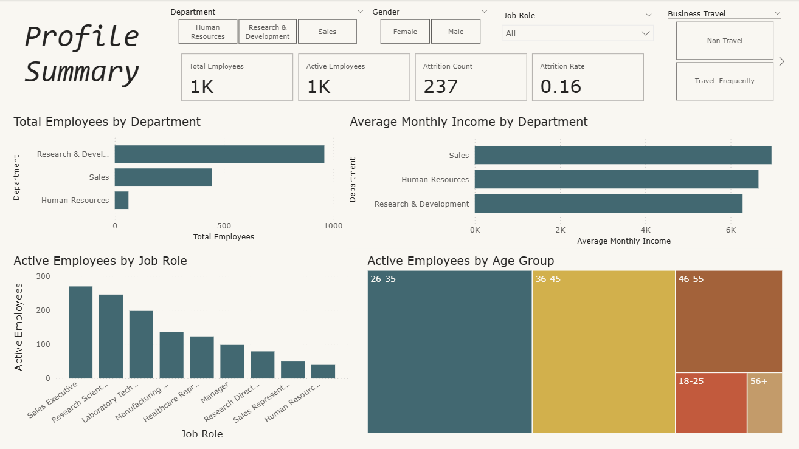
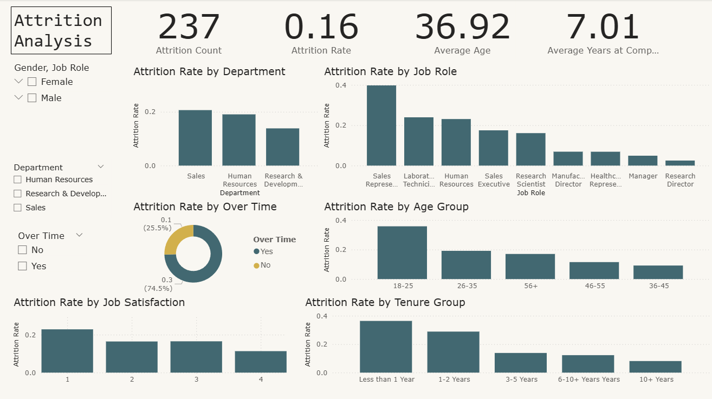

# HR Attrition Analytics Dashboard

## Project Overview

This project is a Power BI dashboard built using the IBM HR Analytics Employee Attrition & Performance dataset from Kaggle.

The dashboard analyses employee attrition patterns across departments, job roles, overtime, income, job satisfaction, work-life balance, age groups, and years at the company.

The purpose of this project is to practise Power BI dashboard development while showcasing skills in data preparation, DAX measures, KPI design, HR analytics, and business insight communication.

Unlike a sales dashboard, this project focuses on workforce analytics and employee retention risk.

## Dataset

Dataset: [IBM HR Analytics Employee Attrition & Performance on Kaggle](https://www.kaggle.com/datasets/pavansubhasht/ibm-hr-analytics-attrition-dataset)

The dataset contains fictional HR employee records with information such as employee demographics, department, job role, income, overtime, job satisfaction, work-life balance, and attrition status.

The raw dataset is not stored in this repository. It can be downloaded from the Kaggle link above.

## Dashboard Preview

## Business Questions

This dashboard explores the following questions:

1. What is the overall employee attrition rate?
2. Which departments and job roles have higher attrition?
3. How does overtime relate to employee attrition?
4. How do income, age, and years at company differ between employees who stayed and employees who left?
5. How do job satisfaction and work-life balance relate to attrition?
6. Which employee groups may require more retention attention?

## Key Metrics

The dashboard includes the following metrics:

* Total Employees
* Active Employees
* Attrition Count
* Attrition Rate
* Average Age
* Average Monthly Income
* Average Years at Company
* Attrition by Department
* Attrition by Job Role
* Attrition by Overtime
* Attrition by Job Satisfaction
* Attrition by Work-Life Balance

## Dashboard Pages

### 1. Workforce Overview

This page provides a high-level summary of the workforce.

It includes KPI cards for total employees, active employees, attrition count, attrition rate, average age, and average monthly income.

It also shows employee distribution by department, job role, gender, and age group.

The purpose of this page is to give users a quick understanding of the workforce structure before analysing attrition in detail.

### 2. Attrition Analysis

This page focuses on employee attrition patterns.

It analyses attrition by department, job role, overtime, job satisfaction, work-life balance, income band, and years at company.

The purpose of this page is to identify workforce groups with higher attrition rates and support HR retention analysis.

## Notes

This is a practice and portfolio project using a fictional HR dataset. The dashboard is intended to demonstrate Power BI and business intelligence skills in an HR analytics context.
