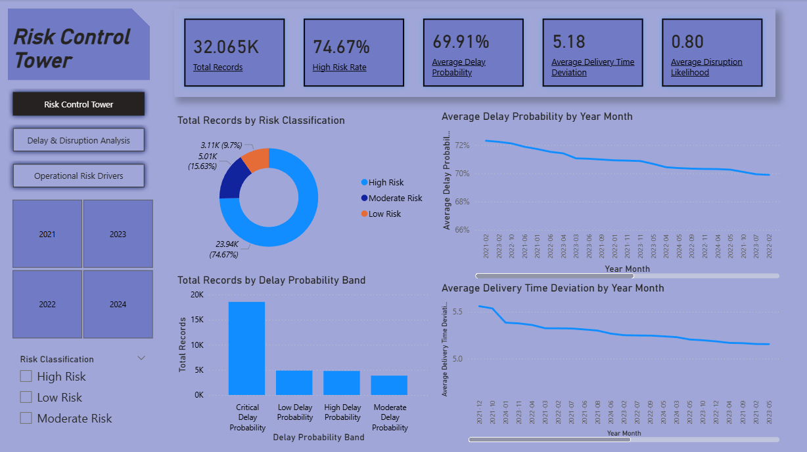
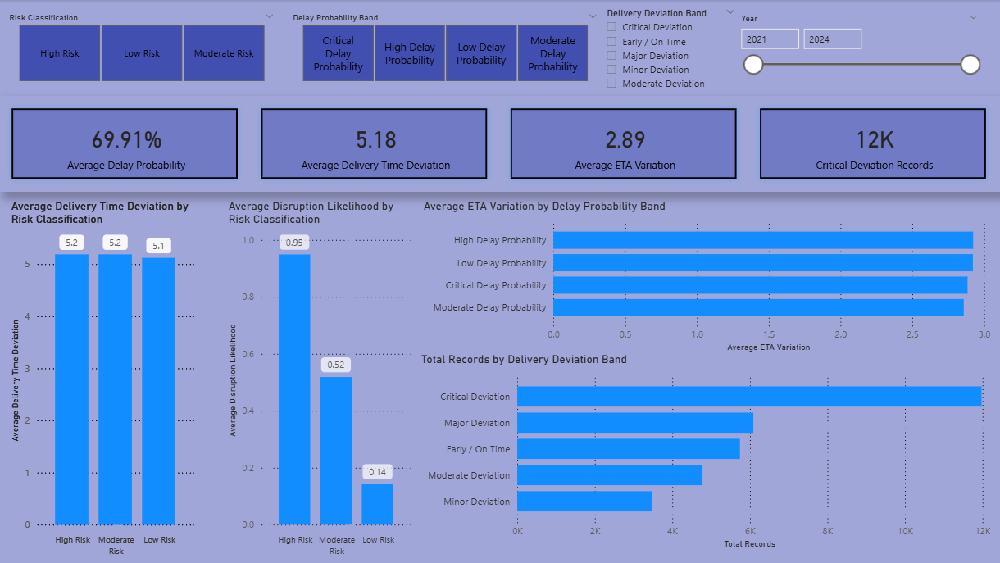
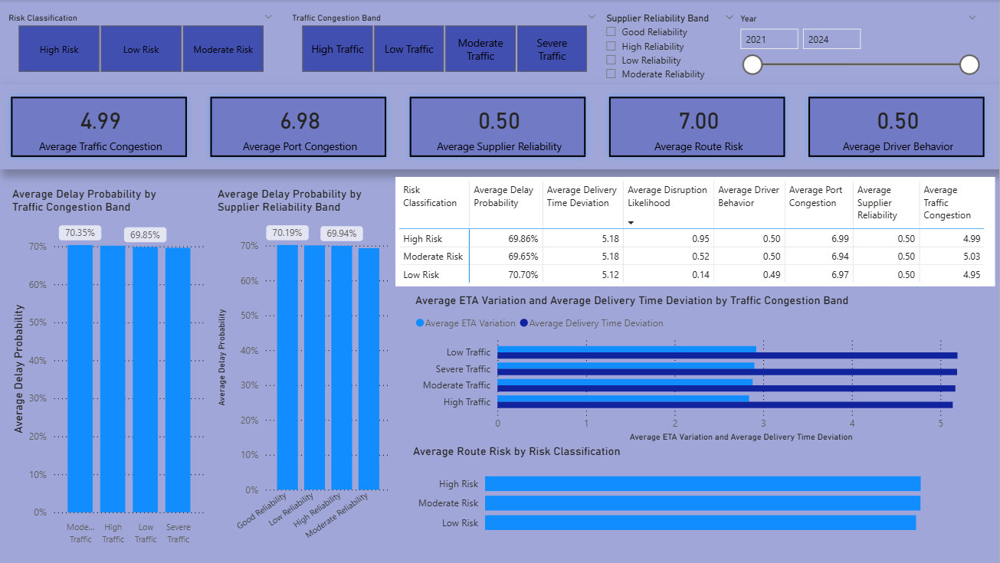

# Dynamic Supply Chain Risk Control Tower

## Project Overview

This project is a Power BI dashboard built using a dynamic supply chain logistics dataset from Kaggle.

The dashboard analyses logistics risk, delay probability, delivery time deviation, congestion, supplier reliability, driver behaviour, fuel consumption, port congestion, weather severity, and operational conditions.

The purpose of this project is to practise Power BI dashboard development while showcasing skills in supply chain analytics, risk monitoring, KPI design, DAX measures, Power Query transformation, and professional dashboard design.

The dashboard is designed as a supply chain risk control tower, allowing users to monitor logistics risk levels, identify delay drivers, compare operational conditions, and understand patterns across time.

## Dataset

Dataset: Dynamic Supply Chain Logistics Dataset from Kaggle.

The dataset contains hourly logistics and supply chain monitoring records from 2021 to 2024. It includes fields related to vehicle location, congestion, warehouse inventory, loading/unloading time, supplier reliability, port congestion, driver behaviour, fatigue monitoring, disruption likelihood, delay probability, risk classification, and delivery time deviation.

The raw dataset is not stored in this repository. It can be downloaded from Kaggle.

## Dashboard Preview

## Analytical Questions

This dashboard explores the following questions:

1. What is the overall logistics risk profile?
2. How often do operations fall into high, moderate, and low risk classifications?
3. How does delay probability change over time?
4. Which operational factors are associated with higher delivery time deviation?
5. How do traffic congestion, port congestion, weather severity, and supplier reliability relate to risk?
6. What conditions indicate possible supply chain disruption?

## Key Metrics

The dashboard includes the following metrics:

- Total Records
- Average Delay Probability
- Average Delivery Time Deviation
- Average ETA Variation
- Average Traffic Congestion Level
- Average Port Congestion Level
- Average Supplier Reliability Score
- High Risk Records
- High Risk Rate
- Average Disruption Likelihood Score
- Average Route Risk Level

## Dashboard Pages

### 1. Risk Control Tower

This page provides a high-level monitoring view of logistics risk.

It includes KPI cards, risk classification distribution, delay probability trend, delivery time deviation trend, and high-level operational risk indicators.

### 2. Delay & Disruption Analysis

This page focuses on delay probability, delivery time deviation, disruption likelihood, ETA variation, and risk classification.

It helps identify how logistics delay risk changes over time and across risk levels.

### 3. Operational Risk Drivers

This page analyses possible operational drivers of risk, including traffic congestion, port congestion, weather severity, supplier reliability, driver behaviour, fatigue monitoring, fuel consumption, and cargo condition.

It helps explain which operational conditions may be linked to higher logistics risk.

## Tools Used

- Power BI
- Power Query
- DAX
- Kaggle dataset

## Notes

This project uses a public dataset for portfolio and learning purposes. The dashboard is intended to demonstrate supply chain analytics and Power BI dashboard design skills.