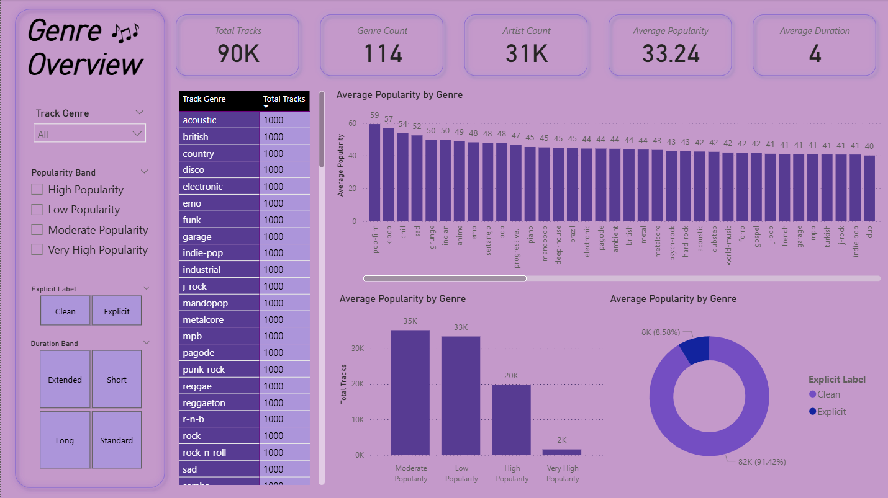
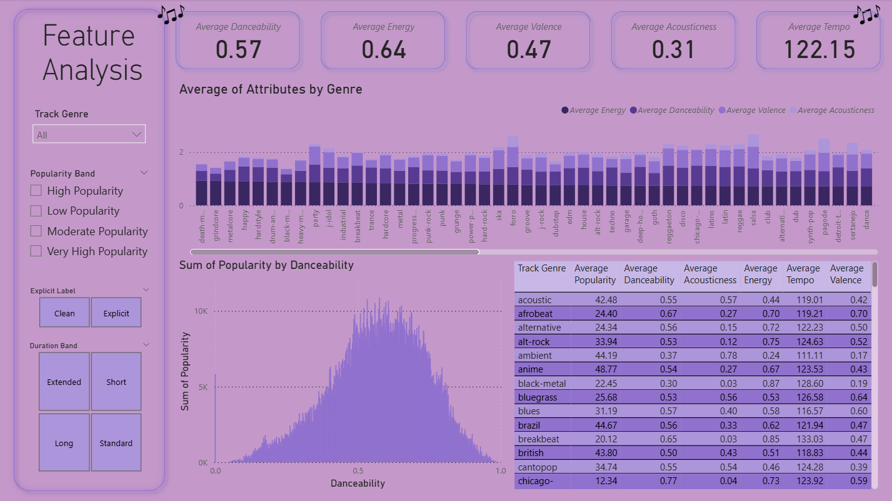
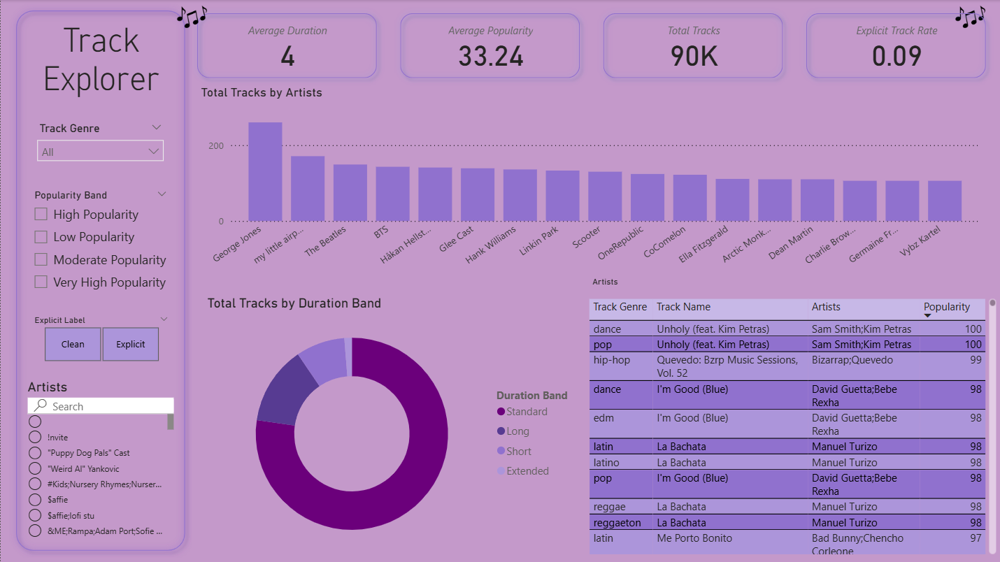

# Spotify Music Intelligence Dashboard

## Project Overview

This project is a Power BI dashboard built using a Spotify tracks dataset from Kaggle.

The dashboard analyses track popularity, genre patterns, artist activity, song duration, explicit content, and audio features such as danceability, energy, acousticness, valence, tempo, and speechiness. The purpose of this project is to practise Power BI dashboard development while showcasing skills in data preparation, DAX measures, KPI design, audio-feature analysis, visual storytelling, and interactive dashboard design.

## Dataset

Dataset: [Spotify Tracks Dataset on Kaggle](https://www.kaggle.com/datasets/maharshipandya/-spotify-tracks-dataset)

## Dashboard Preview

## Analytical Questions

This dashboard explores the following questions:

1. Which genres have the highest average popularity?
2. Which artists and tracks stand out in the dataset?
3. How do audio features differ across genres?
4. How do danceability, energy, valence, and acousticness relate to popularity?
5. How does explicit content compare with non-explicit content?
6. What does the audio profile of a selected genre or track look like?

## Dashboard Sections

### 1. Genre Overview

This section provides a high-level summary of Spotify track patterns.

Included metrics:

- Total Tracks
- Number of Genres
- Number of Artists
- Average Popularity
- Average Duration

This section gives users an immediate understanding of the overall size and structure of the dataset.

### 2. Popularity and Genre Analysis

This section compares average popularity across genres and artists.

It helps identify which genres and artists have higher average popularity in the dataset.

### 3. Audio Feature Analysis

This section analyses musical characteristics such as danceability, energy, valence, acousticness, speechiness, and tempo.

It helps compare the sound profile of different genres and track groups.

### 4. Track Explorer

This section allows users to filter by genre, artist, explicit content, and popularity band to explore individual tracks and their audio profiles.

## Notes

This is a practice and portfolio project using a public dataset. The dashboard is intended to demonstrate Power BI and music/audio analytics skills rather than provide official Spotify platform insights.