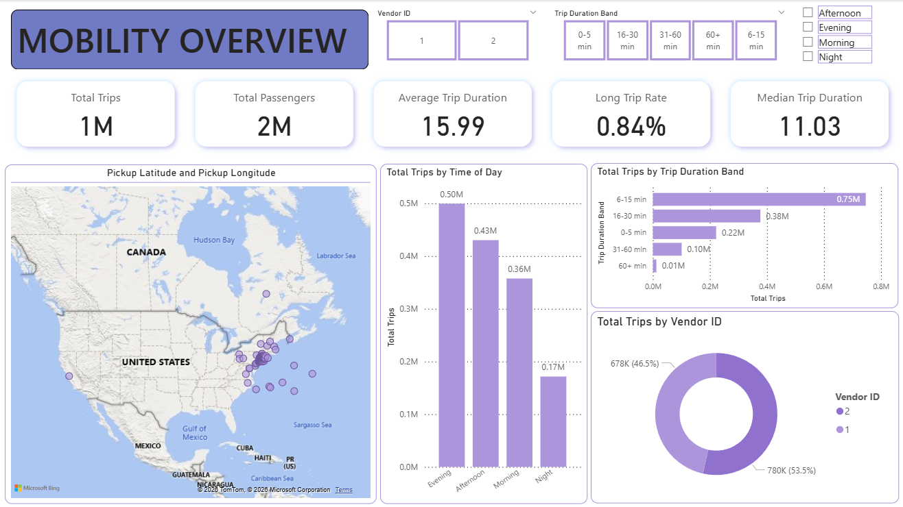

# NYC Taxi Mobility Intelligence Dashboard

## Project Overview

This project is a Power BI dashboard built using an NYC taxi trip dataset from Kaggle.

The dashboard analyses taxi trip demand, pickup and dropoff locations, trip duration, passenger count, time-of-day patterns, and operational efficiency. The purpose of this project is to practise Power BI dashboard development while showcasing skills in data preparation, DAX measures, geospatial analysis, KPI design, visual analysis, and business insight communication.

## Dataset

Dataset: [NYC Taxi Trip Duration on Kaggle](https://www.kaggle.com/datasets/yasserh/nyc-taxi-trip-duration)

## Dashboard Preview

## Business Questions

This dashboard explores the following questions:

1. What is the overall taxi trip volume?
2. When is taxi demand highest by hour, day, and month?
3. Where are the most active pickup and dropoff locations?
4. How long do taxi trips usually take?
5. How does passenger count relate to trip duration?
6. Which trips appear unusually long or inefficient?

## Dashboard Sections

### 1. Mobility Overview

The top section of the dashboard provides a quick overview of taxi operations using KPI cards.

Included metrics:

- Total Trips
- Average Trip Duration
- Average Passenger Count
- Total Passengers
- Long Trip Rate

This section gives users an immediate understanding of the overall scale and mobility pattern of the dataset.

### 2. Demand Over Time

This section shows how taxi demand changes by hour, weekday, and month.

It helps identify peak demand periods and quieter operating periods.

### 3. Pickup and Dropoff Location Analysis

This section uses map visuals to show active pickup and dropoff locations.

It helps identify high-activity mobility zones and location-based demand patterns.

### 4. Trip Duration and Efficiency Analysis

This section groups trips by duration bands and highlights unusually long trips.

It helps analyse trip efficiency and identify potential operational outliers.

### 5. Passenger and Vendor Analysis

This section compares trip behaviour by passenger count and vendor.

It helps understand how trip patterns differ across customer group size and taxi providers.

## Notes

This is a practice and portfolio project using a public dataset. The dashboard is intended to demonstrate Power BI and business intelligence skills in transport, mobility, and operational analytics.