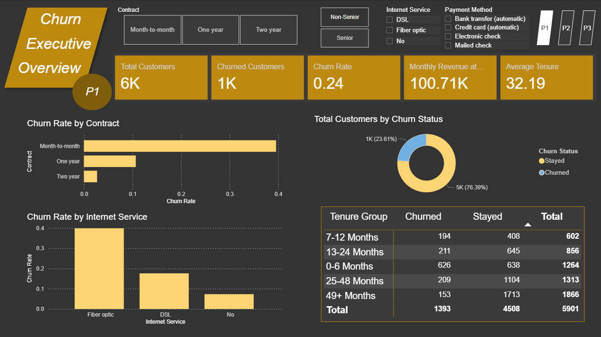
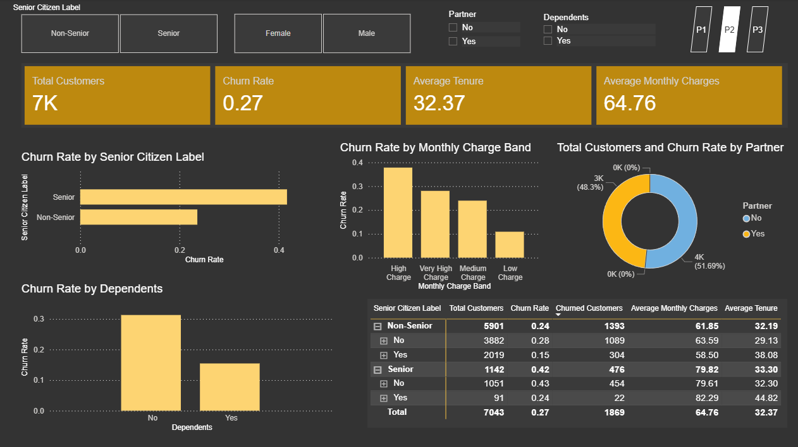
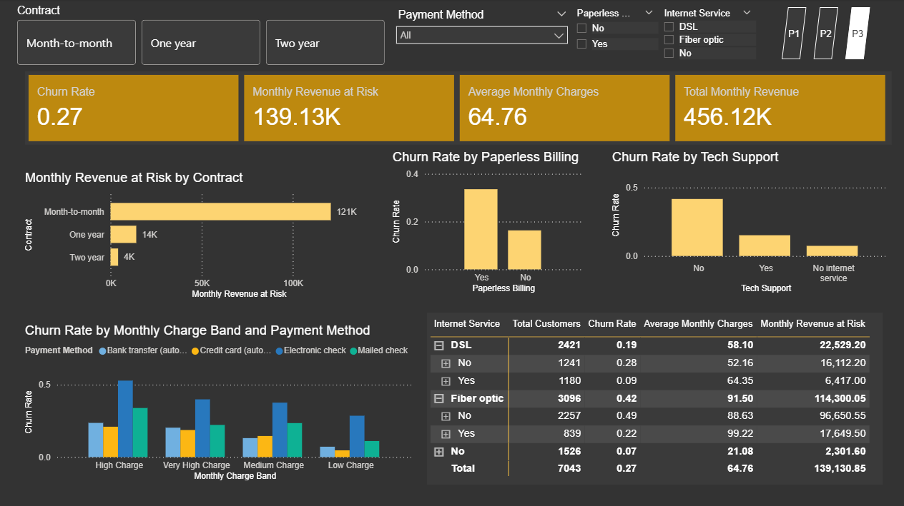

# Telco Customer Churn Dashboard

## Project Overview

This project is a Power BI dashboard built using the Telco Customer Churn dataset from Kaggle.

The dashboard analyses customer churn patterns across contract type, tenure, internet service, payment method, monthly charges, and customer segments. The purpose of this project is to practise Power BI dashboard development while showcasing skills in data preparation, DAX measures, KPI design, customer segmentation, visual analysis, and business insight communication.

## Dataset

Dataset: [Telco Customer Churn on Kaggle](https://www.kaggle.com/datasets/blastchar/telco-customer-churn)

The dataset contains fictional telecom customer records with fields such as:

- Customer ID
- Gender
- Senior Citizen
- Partner
- Dependents
- Tenure
- Phone Service
- Internet Service
- Contract
- Payment Method
- Monthly Charges
- Total Charges
- Churn

The raw dataset is not stored in this repository. It can be downloaded from the Kaggle link above.

## Dashboard Preview

## Business Questions

This dashboard explores the following questions:

1. What is the overall customer churn rate?
2. Which contract types have the highest churn?
3. How does customer tenure relate to churn?
4. Which internet service types are associated with higher churn?
5. How do payment methods and monthly charges relate to churn?
6. How much monthly revenue is at risk from churned customers?

## Tools Used

- Power BI
- Power Query
- DAX
- Kaggle dataset

## Data Preparation

Basic data preparation was completed in Power Query:

- Checked and corrected column data types
- Converted `TotalCharges` from text to decimal number
- Replaced blank values in `TotalCharges` where needed
- Created a readable senior citizen label
- Created tenure groups for customer lifecycle analysis
- Created monthly charge bands for pricing-level comparison
- Created a churn status field for clearer dashboard labels

## Notes

This is a practice and portfolio project using a fictional dataset. The dashboard is intended to demonstrate Power BI and business intelligence skills in customer churn and retention analysis.