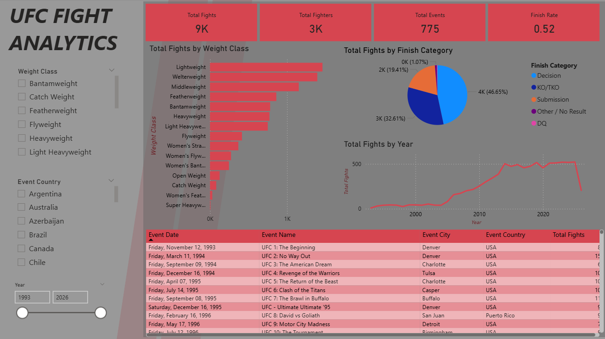
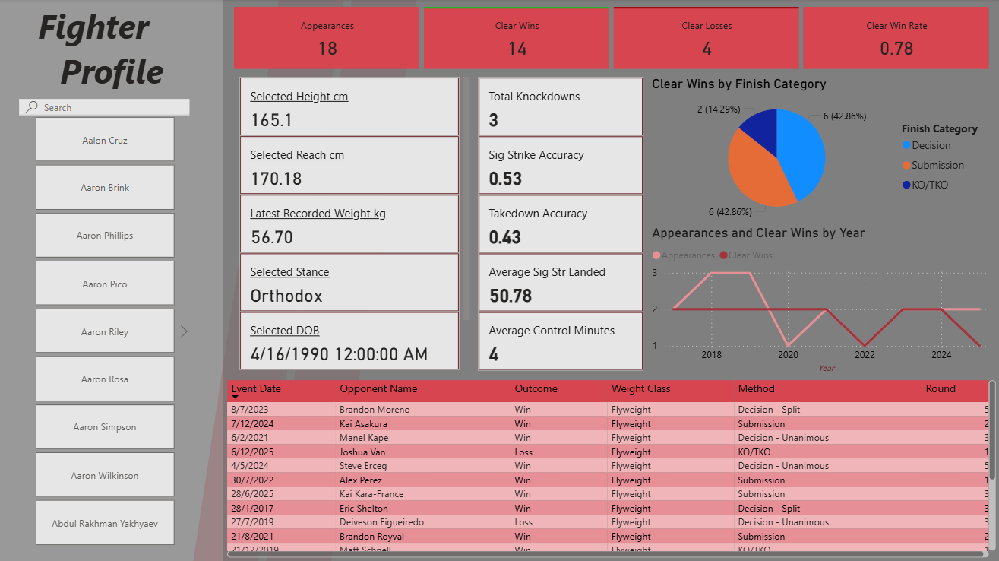
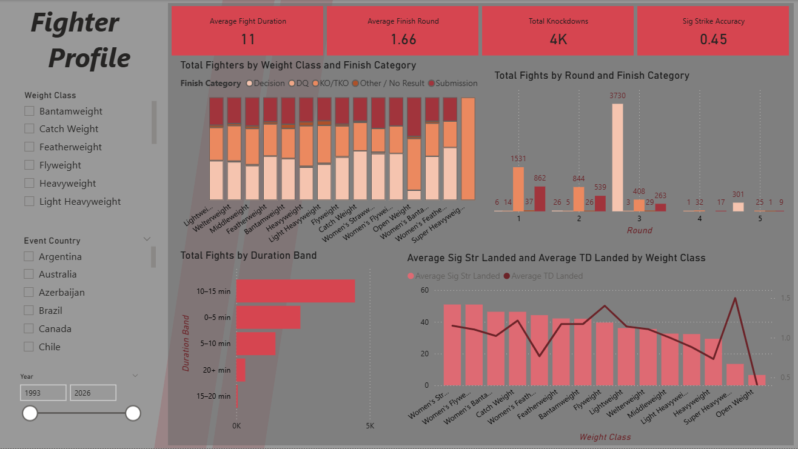
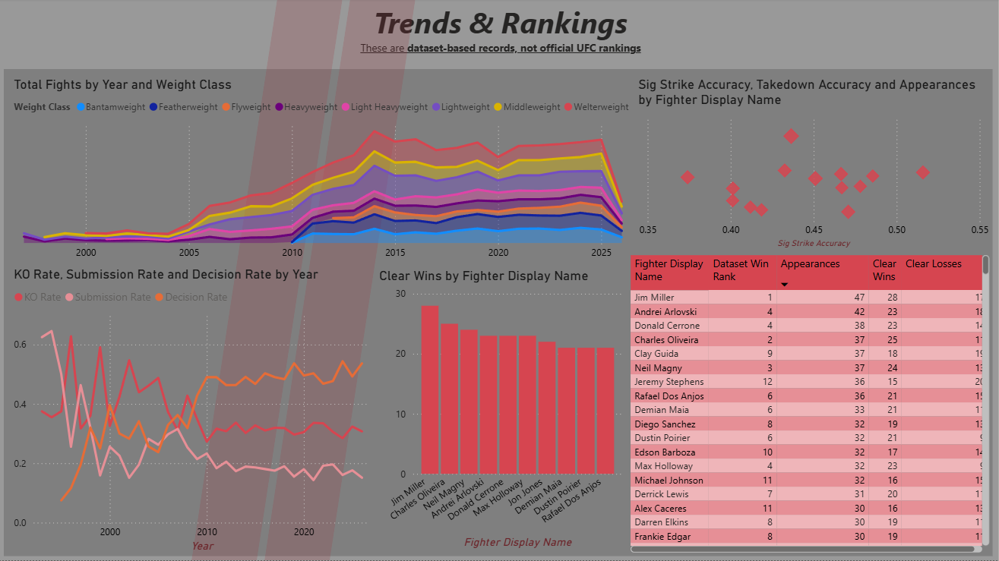

# UFC Fight Intelligence Dashboard

## Project Overview

This project is a Power BI dashboard built using a historical UFC fight statistics dataset.

The dashboard analyses UFC fight outcomes, finishing methods, weight classes, striking performance, takedown performance, control time, fighter records, and historical trends. It also includes an interactive fighter comparison system for analysing the statistical profiles of two selected fighters.

The purpose of this project is to demonstrate Power BI skills in data preparation, data modelling, DAX, sports analytics, KPI design, fighter-level performance analysis, and interactive dashboard development.

## Dataset

The dataset contains historical UFC fight and fighter statistics from 1993 to 2026.

The data includes:

- Event information
- Fighter names
- Weight classes
- Fight outcomes
- Winning methods
- Fight duration
- Fighter height, weight, reach, stance, and date of birth
- Knockdowns
- Significant strikes landed and attempted
- Takedowns landed and attempted
- Control time

The raw dataset is not stored in this repository.

## Dashboard Preview

## Analytical Questions

This dashboard explores the following questions:

1. How has UFC fight activity changed over time?
2. Which weight classes have the highest finishing rates?
3. How frequently are fights won by KO/TKO, submission, or decision?
4. How have fight outcomes changed across different UFC eras?
5. Which fighters demonstrate strong striking or grappling performance?
6. How do individual fighters perform across their UFC fight history?
7. How do two selected fighters compare statistically?

## Notes

This is a portfolio and practice project using historical UFC fight statistics. The dashboard is designed for exploratory sports analytics and should not be interpreted as a predictive model for future fight outcomes.