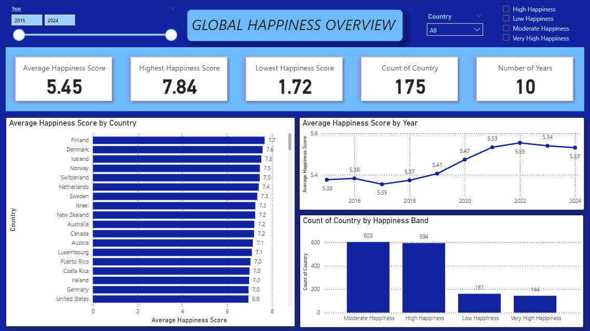
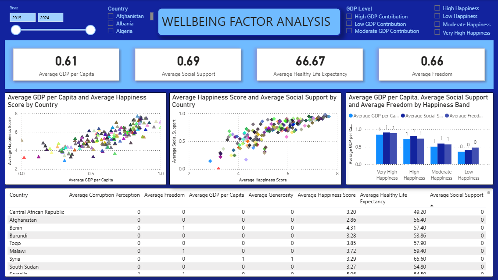
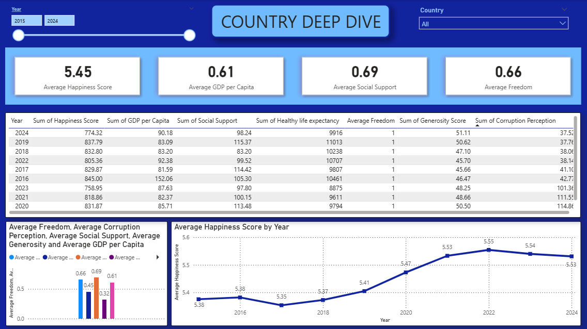

# World Happiness & Wellbeing Dashboard

## Project Overview

This project is a Power BI dashboard built using a World Happiness Report dataset from Kaggle.

The dashboard analyses global happiness scores across countries and years, comparing factors such as GDP per capita, social support, healthy life expectancy, freedom, generosity, and perceptions of corruption. The purpose of this project is to practise Power BI dashboard development while showcasing skills in data preparation, KPI design, trend analysis, country comparison, factor analysis, and public-policy style insight communication.

## Dataset

Dataset: [World Happiness 2015–2024 on Kaggle](https://www.kaggle.com/datasets/yadiraespinoza/world-happiness-2015-2024)

## Dashboard Preview

## Analytical Questions

This dashboard explores the following questions:

1. Which countries have the highest and lowest happiness scores?
2. How does happiness differ across countries and regions?
3. How have happiness scores changed over time?
4. Which factors are most strongly associated with happiness?
5. How do economic, social, health, and governance-related indicators compare?
6. Which countries may be overperforming or underperforming compared with their GDP level?

## Dashboard Sections

### 1. Global Happiness Overview

This section provides a high-level view of global happiness scores.

Included metrics:

- Average Happiness Score
- Highest Happiness Score
- Lowest Happiness Score
- Number of Countries
- Number of Years

This section gives users an immediate understanding of the overall happiness distribution in the dataset.

### 2. Country Ranking Analysis

This section compares countries by happiness score.

It helps identify the highest-ranked and lowest-ranked countries and supports country-level comparison.

### 3. Happiness Trend Over Time

This section shows how average happiness scores change across years.

It helps identify whether global happiness is increasing, decreasing, or remaining stable over time.

### 4. Factor Contribution Analysis

This section compares GDP per capita, social support, healthy life expectancy, freedom, generosity, and corruption-related indicators.

It helps explore which wellbeing factors are associated with higher happiness scores.

### 5. Country Deep Dive

This section allows users to select a country and review its happiness score, factor profile, and trend over time.

It helps turn the dashboard from a static ranking report into an interactive country-level analysis tool.